<!-- ===================== HEADER ===================== -->

  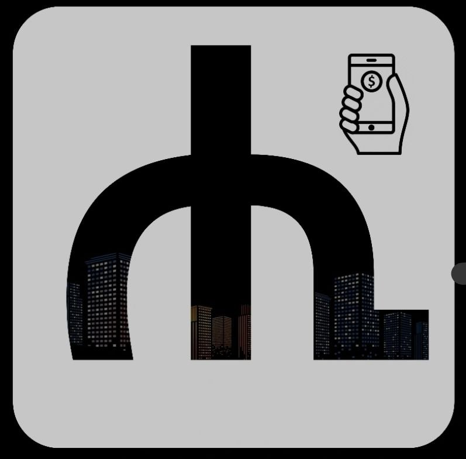

<h1 align="center">💰 Hisab / ሒሳብ</h1>

  <b>Smart Finance. Zero Effort.</b> 
  <i>Track your money automatically — no manual work needed.</i>

  
  
  

---

<!-- ===================== INTRO ===================== -->

## ⚡ About Hisab

**Hisab** is a modern personal finance app built specifically for Ethiopian banking systems.

It automatically reads your **bank SMS messages** and converts them into a clean, powerful financial dashboard — so you never have to track expenses manually again.

> 💡 No internet. No cloud. No data leaks.  
> Everything stays **on your device**.

---

<!-- ===================== WHY ===================== -->

## 🔥 Why Hisab?

<table>
<tr>
<td>📲</td>
<td><b>Automatic Tracking</b> No manual expense entry</td>
</tr>
<tr>
<td>🏦</td>
<td><b>All Banks in One Place</b> Unified dashboard view</td>
</tr>
<tr>
<td>🔒</td>
<td><b>Privacy First</b> Your data never leaves your phone</td>
</tr>
<tr>
<td>⚡</td>
<td><b>Fast & Offline</b> Works without internet</td>
</tr>
</table>

---

<!-- ===================== FEATURES ===================== -->

## ✨ Features

### 📩 Smart SMS Parsing
- Automatically detects bank SMS
- Extracts:
  - 💸 Amount  
  - 🔁 Transaction type  
  - 🧾 Balance  

---

### 💳 Unified Dashboard
- View all accounts in one place  
- Instant total balance overview  

---

### 🔐 Security & Privacy
- 🔑 Biometric lock (Fingerprint / Face ID)  
- 🙈 Hide balance mode  
- 📵 Fully offline storage  

---

### 📊 Insights & Analytics
- Track spending habits  
- Understand where your money goes  

---

### 🏦 Custom Bank Support
- Add your own bank parsing rules  
- Customize logos and formats  

---

<!-- ===================== SCREENSHOT PLACEHOLDER ===================== -->

## 📸 App Preview

### 🏠 Home Screen

  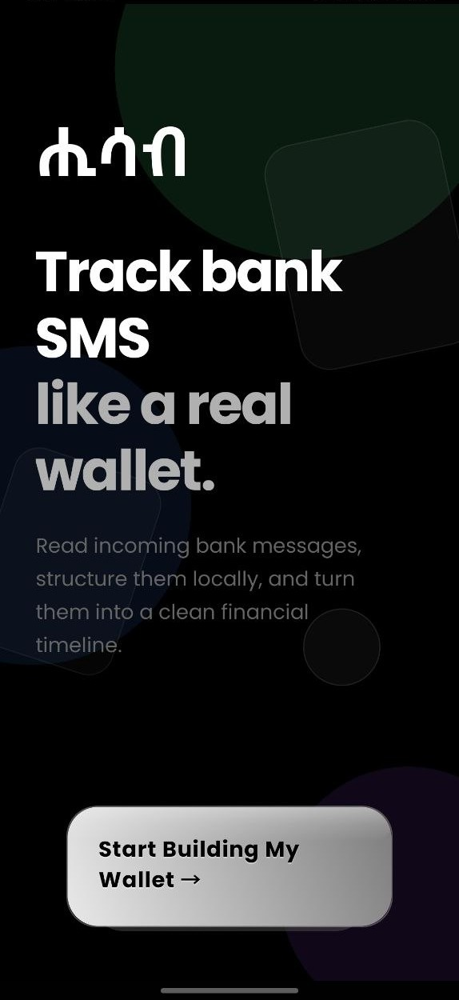
  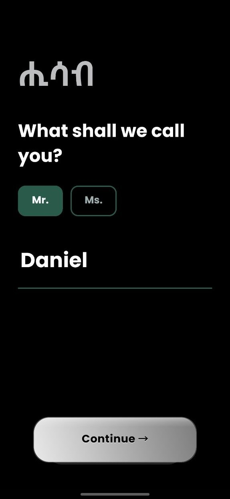
  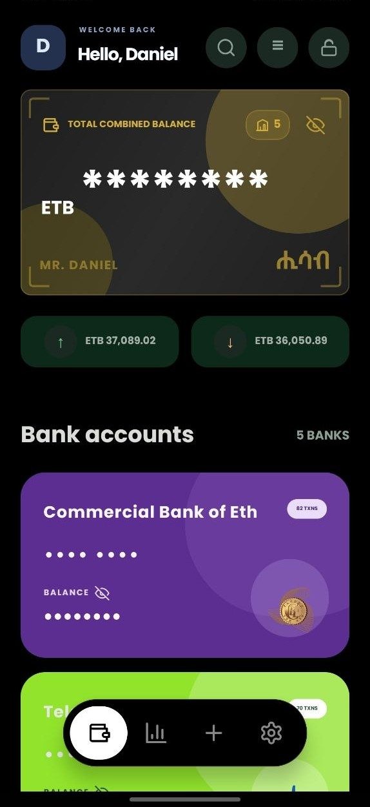

### 📊 Analytics & Insights

  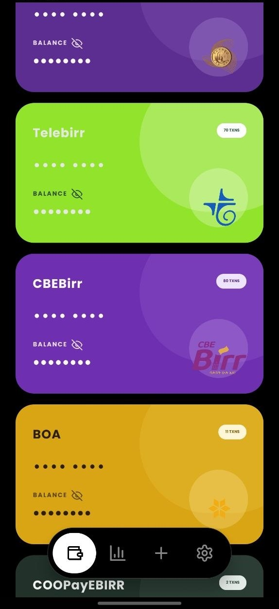
  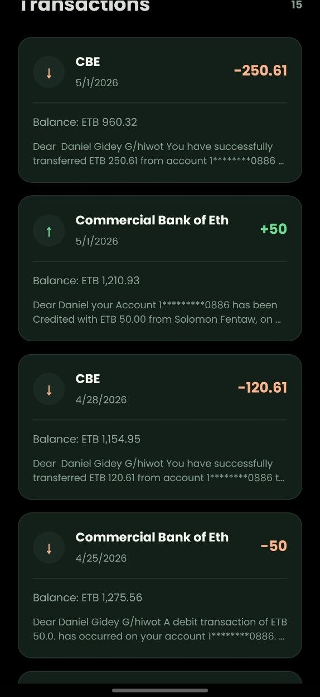
  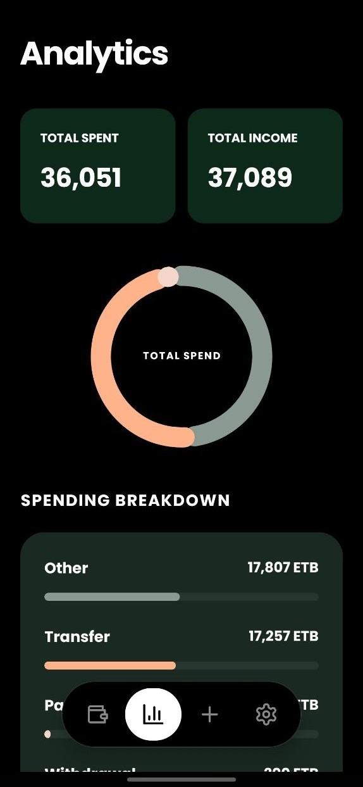

### 🔐 Security & Settings

  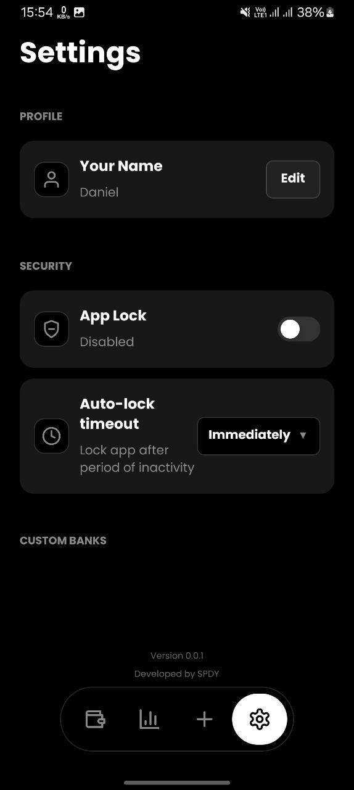
  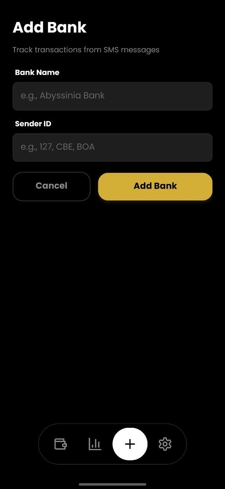
  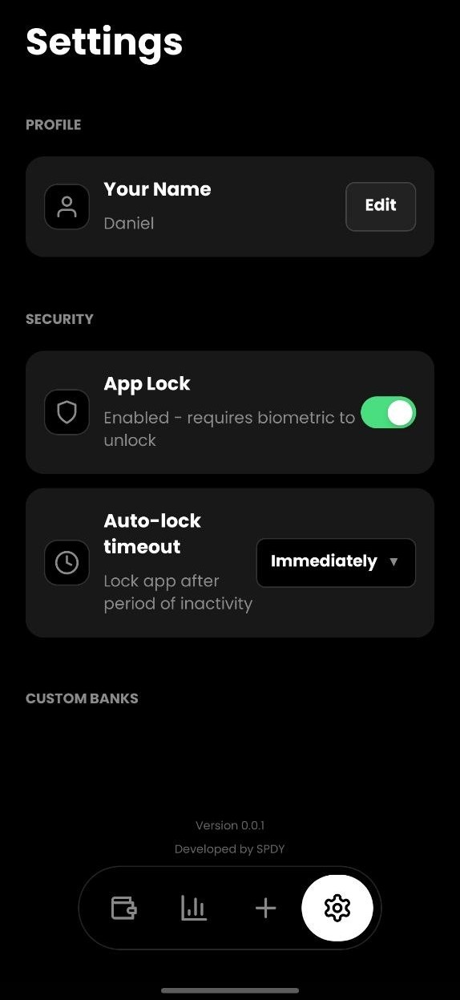

### 👆 Finger Print Scan

  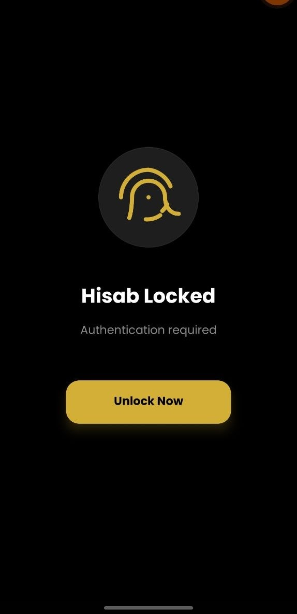

---

<!-- ===================== INSTALL ===================== -->

## 📦 Download & Install
<!-- ===================== DOWNLOAD ===================== -->

## 📦 Download

  

  <b>👉 Tap the button above to download the app</b>

---

## ⚠️ Installation Guide

Since this app is not from the Play Store:

1. Download the APK  
2. Open the file  
3. If blocked:
   - Go to **Settings → Security**
   - Enable **"Install Unknown Apps"**  
4. If blocked because of Play Protect:
   - Go to **Settings → Google → Play Protect**
   - **Pause Play Protect** temporarily  
   - Install the app  
   - **Enable Play Protect** again after installation  
5. Install and open 🚀  

---

## 🔐 Permissions

Hisab requires the following permissions:

- 📩 **SMS Access** → To read bank transaction messages  
- 🔒 **Biometric Access** → To secure your app  

> 💡 Your data is processed **locally only** — nothing is uploaded.
``

---

## 🧠 Tech Stack

  

<table align="center">
<tr>
<td align="center">⚛️</td>
<td><b>Framework</b></td>
<td>React Native</td>
</tr>

<tr>
<td align="center">🟦</td>
<td><b>Language</b></td>
<td>TypeScript</td>
</tr>

<tr>
<td align="center">🗄️</td>
<td><b>Database</b></td>
<td>SQLite</td>
</tr>

<tr>
<td align="center">🔐</td>
<td><b>Security</b></td>
<td>Biometric Authentication</td>
</tr>

<tr>
<td align="center">🎨</td>
<td><b>UI</b></td>
<td>Custom + SVG + Gradients</td>
</tr>
</table>
---

<!-- ===================== PHILOSOPHY ===================== -->

## 🧭 Philosophy

> 💡 "Finance apps shouldn’t own your data — you should."

Hisab is built on three core principles:

* 🔒 **Privacy First**
* ⚡ **Speed & Simplicity**
* 📱 **Offline Power**

---

<!-- ===================== CTA ===================== -->

## 🚀 Get Started

Download the APK, install, and let Hisab do the work for you.

  <b>Take control of your finances today.</b>

---

<!-- ===================== FOOTER ===================== -->

  Made with ❤️ by Daniel Gidey for You

  <b>📬 Connect with me:</b> 
  
  
  
  
  

